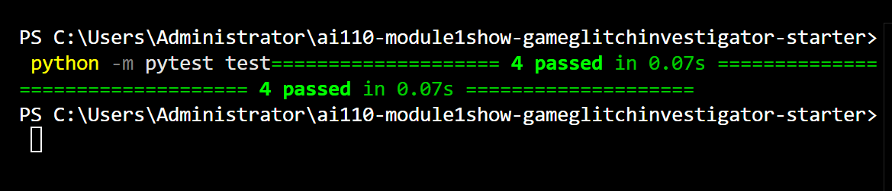
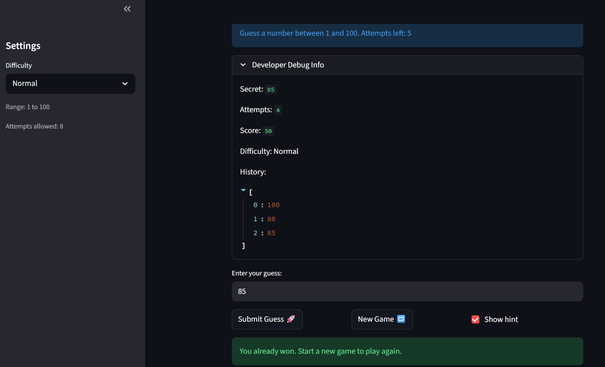

# 🎮 Game Glitch Investigator: The Impossible Guesser

## 🚨 The Situation

You asked an AI to build a simple "Number Guessing Game" using Streamlit.
It wrote the code, ran away, and now the game is unplayable. 

- You can't win.
- The hints lie to you.
- The secret number seems to have commitment issues.

## 🛠️ Setup

1. Install dependencies: `pip install -r requirements.txt`
2. Run the broken app: `python -m streamlit run app.py`

## 🕵️‍♂️ Your Mission

1. **Play the game.** Open the "Developer Debug Info" tab in the app to see the secret number. Try to win.
2. **Find the State Bug.** Why does the secret number change every time you click "Submit"? Ask ChatGPT: *"How do I keep a variable from resetting in Streamlit when I click a button?"*
3. **Fix the Logic.** The hints ("Higher/Lower") are wrong. Fix them.
4. **Refactor & Test.** - Move the logic into `logic_utils.py`.
   - Run `pytest` in your terminal.
   - Keep fixing until all tests pass!

## 📝 Document Your Experience

- [x] The game's purpose is to create a number guessing game where players guess a secret number within a range, with hints to guide them, scoring based on attempts, and difficulty levels affecting the range and attempts allowed.
- [x] Bugs found included: hints were backwards (e.g., "Go HIGHER!" for too high guesses), secret number type inconsistency causing comparison failures on even attempts, history not resetting on new games, and status not resetting properly.
- [x] Fixes applied: Simplified `check_guess` to always use int comparisons, reset history, status, and use difficulty-based ranges on new games, added type safety, and created tests to prevent regressions.

## 🧪 Challenge 1: Advanced Edge-Case Testing

- [x] Completed: Added `test_guess_handles_string_inputs` to test type safety.  
    
  *Screenshot of pytest output showing all 4 tests passing, including the new edge-case test.*

## 📸 Demo

- [x]   
  *Screenshot showing the game after fixes: player has won, with correct hints, stable secret, and reset history.*

## 🚀 Stretch Features

- [ ] [If you choose to complete Challenge 4, insert a screenshot of your Enhanced Game UI here]
